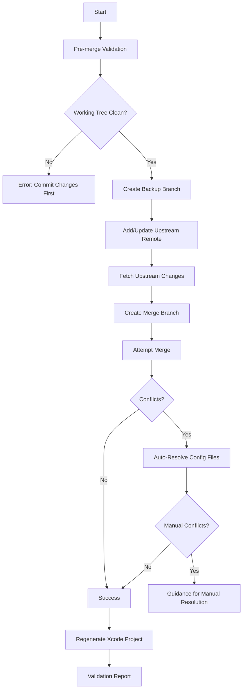

# Upstream Sync Guide

## Overview

This guide explains how to safely sync with the upstream [element-x-ios](https://github.com/element-hq/element-x-ios) repository while preserving all ketal customizations and branding.

The ketal repository is a fork of element-x-ios with significant rebranding and customizations. To benefit from upstream improvements while maintaining our identity, we use an automated sync script that handles conflict resolution intelligently.

## Quick Start

To sync with upstream element-x-ios:

```bash
cd /path/to/ketal_pub
./sync-upstream.sh
```

The script will:
- ✅ Create automatic backups
- ✅ Fetch latest upstream changes
- ✅ Resolve configuration conflicts automatically
- ✅ Regenerate Xcode project files
- ✅ Validate the merge

## Understanding the Fork

### What Changed from element-x-ios to ketal

| Component | Original (element-x-ios) | Ketal |
|-----------|-------------------------|-------|
| **Directory Name** | `ElementX/` | `ketal/` |
| **Project Name** | `ElementX` | `ketal` |
| **Bundle ID** | `io.element.elementx` | `io.ketal.app` |
| **App Group** | `group.io.element` | `group.io.ketal` |
| **Display Name** | `Element X` | `ketal` |
| **Xcode Project** | `ElementX.xcodeproj` | `ketal.xcodeproj` |

### Files Modified for Branding

**Configuration Files** (always keep ketal version):
- `project.yml` - Project name and organization
- `app.yml` - Bundle identifiers and app name
- `ketal/SupportingFiles/target.yml` - Target configuration
- `ketal/SupportingFiles/ketal.entitlements` - App entitlements
- All test target `target.yml` files
- All `.xctestplan` files
- `localazy.json` - Localization paths
- `fastlane/Fastfile` - Build automation
- `.githooks/pre-commit` - Git hooks

**Source Code**:
- All test files: `@testable import ElementX` → `@testable import ketal`
- Swift source code: Generally unchanged (no import changes needed)

## The sync-upstream.sh Script

### How It Works



### Script Features

#### 1. Pre-merge Safety Checks
- Verifies you're on the `main` branch
- Ensures working tree is clean (no uncommitted changes)
- Checks for existing merge in progress

#### 2. Automatic Backup
Creates a timestamped backup branch:
```bash
backup-before-upstream-sync-YYYY-MM-DD-HHMMSS
```

#### 3. Intelligent Conflict Resolution

**Configuration Files** - Automatically keeps ketal version:
- `project.yml` → Keep `name: ketal`
- `app.yml` → Keep ketal bundle IDs
- `*.target.yml` → Keep ketal target references
- Test files → Preserve `@testable import ketal`

**Source Code** - Flags for manual review if conflicts

#### 4. Post-merge Validation
- Runs `swift run tools setup-project` (xcodegen)
- Verifies key ketal configurations are preserved
- Reports any remaining conflicts

#### 5. Rollback Support
If something goes wrong:
```bash
git reset --hard backup-before-upstream-sync-YYYY-MM-DD-HHMMSS
```

## Using the Script

### Prerequisites

1. **Clean working tree**:
   ```bash
   git status  # Should show "nothing to commit, working tree clean"
   ```

2. **On main branch**:
   ```bash
   git checkout main
   ```

3. **Internet connection** (to fetch from GitHub)

### Running the Sync

```bash
./sync-upstream.sh
```

### What to Expect

#### Normal Execution

```
🔍 Pre-merge validation...
✅ Working tree is clean
✅ On main branch

💾 Creating backup...
✅ Created backup: backup-before-upstream-sync-2026-02-09-190647

🔗 Setting up upstream remote...
✅ Upstream configured: https://github.com/element-hq/element-x-ios.git

📥 Fetching upstream changes...
✅ Fetched from upstream/main

🔀 Merging upstream/main...
⚠️  Conflicts detected in configuration files
✅ Auto-resolved: project.yml
✅ Auto-resolved: app.yml
✅ Auto-resolved: ketal/SupportingFiles/target.yml

🔨 Regenerating Xcode project...
✅ xcodegen completed successfully

✅ Upstream sync completed successfully!
```

#### If Manual Conflicts Occur

```
⚠️  Manual conflicts detected in:
  - ketal/Sources/Services/SomeService.swift
  
Please resolve these conflicts manually:
  1. Edit the conflicted files
  2. git add <resolved-files>
  3. git commit
  4. ./sync-upstream.sh --continue (if needed)
```

## Manual Conflict Resolution

If source code conflicts occur, follow these steps:

### 1. Identify Conflicts

```bash
git status
# Shows files with conflicts
```

### 2. Examine the Conflict

Open the file and look for conflict markers:

```swift
<<<<<<< HEAD (ketal)
// Your ketal-specific code
=======
// Upstream element-x-ios code
>>>>>>> upstream/main
```

### 3. Resolve Strategically

**For ketal-specific features**: Keep your version
```swift
// Keep this if it's a ketal-only feature
```

**For upstream improvements**: Integrate their changes
```swift
// Merge upstream improvements into your code
```

**For both important**: Combine intelligently
```swift
// Combine both versions if both are needed
```

### 4. Mark as Resolved

```bash
git add <resolved-file>
```

### 5. Complete the Merge

```bash
git commit -m "Merge upstream/main - keep ketal branding"
```

### 6. Regenerate Project

```bash
swift run tools setup-project
```

## Post-Sync Validation

After syncing, perform these checks:

### 1. Verify Configuration Integrity

```bash
# Check project name
grep "name: ketal" project.yml

# Check bundle identifier
grep "BASE_BUNDLE_IDENTIFIER: io.ketal.app" app.yml

# Check app display name
grep 'APP_DISPLAY_NAME: "ketal"' app.yml
```

### 2. Build the Project

```bash
swift run tools setup-project
xcodebuild -scheme ketal -configuration Debug build
```

### 3. Run Tests (Optional)

```bash
xcodebuild test -scheme ketal -destination 'platform=iOS Simulator,name=iPhone 15'
```

### 4. Review Changes

```bash
# See what changed
git log -1 -p

# See file changes
git diff HEAD~1 HEAD --stat
```

## Troubleshooting

### "Working tree not clean" Error

**Cause**: You have uncommitted changes

**Solution**:
```bash
git status
git add .
git commit -m "Your commit message"
# Then run sync-upstream.sh again
```

### "Not on main branch" Error

**Cause**: You're on a different branch

**Solution**:
```bash
git checkout main
# Then run sync-upstream.sh again
```

### Xcodegen Fails After Merge

**Cause**: Configuration file syntax error

**Solution**:
```bash
# Check for YAML syntax errors
cat project.yml | grep -A5 -B5 "error pattern"

# Restore from backup if needed
git reset --hard backup-before-upstream-sync-<timestamp>
```

### Build Fails After Sync

**Possible Causes**:
1. Missing dependency updates
2. API changes in upstream
3. Swift version compatibility

**Solution**:
```bash
# 1. Update dependencies
swift run tools setup-project

# 2. Check build logs for specific errors
xcodebuild -scheme ketal clean build 2>&1 | tee build.log

# 3. If major issues, rollback and investigate
git reset --hard backup-before-upstream-sync-<timestamp>
```

### Merge Conflicts in Source Code

**Cause**: Both ketal and upstream modified the same code

**Solution**:
1. Carefully review each conflict
2. Understand what changed in both versions
3. Merge changes intelligently
4. Test the result thoroughly
5. Consider consulting the git history:
   ```bash
   git log --oneline --all --graph -- path/to/file
   ```

## Best Practices

### 1. Sync Regularly

Don't let your fork drift too far from upstream:
- **Recommended**: Monthly syncs
- **Minimum**: Quarterly syncs
- **After major upstream releases**: Within a week

### 2. Test Before Production

Always test the merged code:
1. Build succeeds ✅
2. Unit tests pass ✅
3. Manual testing of core features ✅
4. No crashes or obvious regressions ✅

### 3. Review Upstream Changes

Before syncing, check what's changed upstream:
```bash
git fetch upstream
git log --oneline main..upstream/main
```

### 4. Keep Backups

The script creates automatic backups, but you can also:
```bash
# Manual backup
git tag ketal-stable-$(date +%Y%m%d)
```

### 5. Document Custom Changes

If you add ketal-specific features:
1. Document why they're needed
2. Add comments in code
3. Update this guide if it affects sync process

## Advanced Usage

### Sync from a Specific Upstream Branch

```bash
# Fetch specific branch
git fetch upstream develop

# Create merge branch
git checkout -b merge/upstream-develop
git merge upstream/develop

# Follow manual conflict resolution steps
```

### Selective File Merging

If you only want specific files from upstream:

```bash
git fetch upstream
git checkout upstream/main -- path/to/specific/file
git commit -m "Cherry-pick: Updated specific file from upstream"
```

### Reviewing Upstream Changes Before Merging

```bash
# See what would merge
git fetch upstream
git diff main..upstream/main

# See file changes
git diff main..upstream/main --stat

# See specific file changes
git diff main..upstream/main -- path/to/file
```

## Related Documentation

- [.rebranding-strategy.md](.rebranding-strategy.md) - Detailed rebranding documentation
- [CONTRIBUTING.md](CONTRIBUTING.md) - Contribution guidelines
- [README.md](README.md) - Project overview

## Script Maintenance

### Updating the Sync Script

If upstream changes their structure:

1. Review new configuration files
2. Update the auto-resolve patterns in `sync-upstream.sh`
3. Test with `--dry-run` flag (if implemented)
4. Update this guide with new information

### Reporting Issues

If the sync script fails:

1. Don't panic - you have automatic backups
2. Document the error
3. Rollback to backup
4. Review what changed upstream
5. Update the script if needed

## Summary

The `sync-upstream.sh` script makes it safe and easy to keep ketal up-to-date with element-x-ios improvements while preserving your customizations. Key points:

- ✅ **Automatic backups** protect your work
- ✅ **Intelligent conflict resolution** handles configuration files
- ✅ **Clear validation** ensures nothing breaks
- ✅ **Easy rollback** if something goes wrong

When in doubt, the script will err on the side of caution and ask for manual intervention rather than making risky automatic changes.

Happy syncing! 🚀
